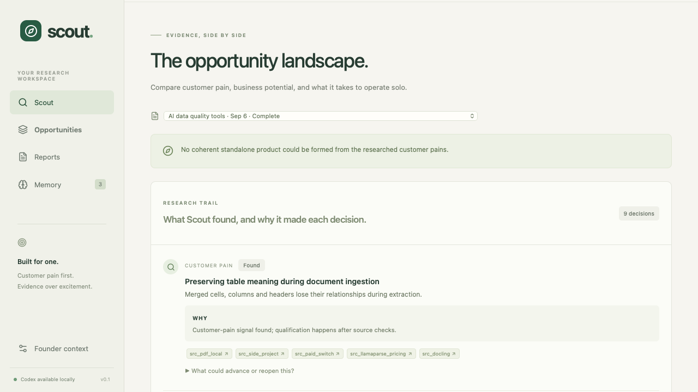

# Opportunity Scout

**Find customer problems worth solving—without turning weak signals into false certainty.**

Opportunity Scout is a local-first research workspace for solo founders. Give it a market, workflow,
or rough direction and it traces public evidence back to real customer pain, tests whether a viable
product could exist, and shows exactly why an opportunity qualifies—or why it does not.



## Why Opportunity Scout?

- **Evidence before ideas.** Every pain, workaround, buying signal, and score stays linked to its source.
- **Skeptical by design.** Unsupported scores remain **Unknown**, deterministic gates reject weak cases,
  and a run can finish with no qualifying opportunities.
- **Built for a solo founder.** Research considers reachability, build scope, operating burden, founder
  constraints, and concrete validation experiments—not just market size.
- **Private and local-first.** Founder context, memory, reports, and research artifacts remain on your
  machine unless you explicitly export them.
- **Useful after the first report.** Investigate weak dimensions, redirect active research, compare
  historical runs, record outcomes, and turn learning into explicit, reversible preferences.

Enter keywords, add optional founder context, and start a scout. It gathers dated public signals,
researches firsthand customer pain, checks alternatives and buying evidence, performs a skeptical
review, and produces nine separate scorecards with confidence and citations.

[See the product walkthrough](docs/DEMO.md)

## Run it

Requirements: Python 3.10+, Node.js 22.12+ (or Node 20.19+), and an authenticated Codex CLI supporting `exec --output-schema`, `--ephemeral`, and `--ignore-user-config`. This implementation was tested with Codex CLI 0.153.4.

```sh
cd opportunity-scout
./setup.sh
codex login
./start.sh
```

Open **http://127.0.0.1:8765**. If Codex is already logged in, the login step is unnecessary.

The local server uses your existing Codex authentication. Each research stage creates an isolated read-only CLI session with live web search and schema-constrained JSON. User configuration, hooks, plugins, connected apps, shell tools, and computer/browser automation are disabled for this worker; its research uses the public web tool. The CLI's default model is used. No separate API key is required.

The worker records Codex token usage when available. A research time limit is not an exact spending cap. Research consumes your account's Codex allowance.

## Workspace

- **Scout:** keywords, optional context, horizon, opportunity limit, live progress, pause, stop, resume, and conversational redirection.
- **Founder-context prompt discovery:** search public pain, launch, marketplace, community, procurement, job, and regulatory signals before choosing keywords; turn promising problem spaces into evidence-linked briefs that prefill a full scout.
- **Trend-window discovery:** inspect GitHub Trending and Product Hunt leaderboards across daily, weekly, and monthly windows, then trace momentum back to customer problems and buyers before suggesting a scout direction.
- **Stable workspace URLs:** `/directions`, `/scout/:run`, `/opportunities/:run/:opportunity`, `/reports`, and `/memory` support bookmarks, refreshes, and browser back/forward navigation.
- **Opportunities:** evidence-backed pain, nine separate scores, confidence, assumptions, alternatives, solo execution estimates, validation experiments, and kill criteria. Switch to Compare scores for a table.
- **Reports:** historical runs, score changes for matched opportunities, Markdown/HTML/JSON/CSV exports, and customer outcome tracking.
- **Research trail:** an optional, collapsed explanation grouped by research phase. It connects customer pains to product hypotheses and later decisions, with reasons, sources, and reopening evidence available on demand. During an active run, **Findings so far** is also collapsed by default.
- **Memory:** explicit preferences and cautiously inferred observations, origins, version history, edit, disable, forget, and undo.
- **Founder context:** optional skills, interests, customer access, geography, time, budget, assets, and hard exclusions. Blank fields remain unknown.

The built-in **example is synthetic** and labeled throughout. It is never created automatically, does no web research, and cannot generate feedback that contaminates learning.

Defaults: 90-day discovery window, up to five opportunities, 20 minutes of research, case-by-case founder cost/time assessment. Older sources can support context, but confidence is reduced when score evidence is entirely old or undated.

## Evidence and scoring

The nine dimensions are pain severity, pain frequency, willingness to pay, demand momentum, competitive opening, customer reachability, solo feasibility, economic potential, and defensibility.

Higher is more favorable, 1–5. Unsupported dimensions become **Unknown**, never zero. Confidence and founder fit are separate. There is no composite score or probability of success. The rubric and anchors are available from `GET /api/health` and stored as version 2.0 in reports.

A recommendation requires:
1. At least two independent firsthand accounts of substantially the same pain.
2. At least one sourced consequence or workaround among those accounts.
3. Usable support for pain severity, willingness to pay, and solo feasibility, each reaching the rubric's middle anchor.
4. No unresolved solo blocker or explicit constraint conflict.
5. A standalone product thesis linking at least two meaningfully different, evidenced pains for the same buyer/job, with recurring value and a bounded first product.
6. A sourced competitor/substitute comparison, checked pricing, firsthand buying evidence, a reachable segment and a reason to switch. Competitive opening must reach the middle scoring anchor.

Structural checks reject broken citation identifiers and malformed scorecards. Unread, incomplete, private-address, and future-dated sources do not support qualification. Repeated original URLs, repeated excerpts, and authors from the same known organization do not create independent corroboration.

**Limits:** source classification, whether a quote entails a claim, estimated costs, and semantic matching remain research-model judgments. The gates do not prove authenticity or market viability. A source marked accessed reflects the research worker's claim of access. Users should inspect citations before acting.

## Product and market validation (rubric 2.0)

A complaint is a research signal, not a startup product. New runs include a **product synthesis** stage that groups related workflow pains into a coherent job for one buyer. The report opens on **Product & market**, showing the customer segment, recurring value, workflow, initial product, expansion path, and risk that an incumbent absorbs the offering.

The market stage compares named direct/adjacent products with native/manual alternatives: target customers, pricing sources, adoption claims, switching costs, and the proposed opening. It includes focused Product Hunt discovery and records relevant launches and positioning, while treating votes and launch attention as neither revenue nor willingness to pay. It records firsthand spending or buying intent separately from vendor-reported adoption, growth signals, and counterevidence. Reachable-market reasoning and pricing hypotheses must expose their assumptions; unsupported buyer counts or giant industry TAMs are not validation.

Product synthesis also separates the daily user from the economic buyer. It records the user's workflow job, the buyer's budget goal, whether they are the same person, and the trigger that creates a purchase. These roles require source evidence and form part of the product qualification gate.

Discovery seeds now include Hacker News, GitHub Issues, Stack Exchange, and EU TED procurement through public APIs. Every run also carries a recorded search plan for SAM.gov, public job postings, vertical app marketplaces, regulatory notices, and SEC EDGAR filings. Each channel is labeled by the evidence it can support—pain, user persona, buyer, budget, competition, adoption, or timing—and unavailable searches remain visible in the run log.

The automated gates require two distinct linked pain records, firsthand support for each, a coherent standalone product case, at least two sourced alternatives spanning a product competitor and native/manual substitute, a checked product pricing model, and firsthand buying evidence. The researcher should investigate three or more alternatives where available, without inventing them to meet a count. A feature or bugfix is rejected; missing product/market evidence stays watch. Competitors can demonstrate a market rather than automatically disqualifying it.

These are coverage and reasoning checks, not proof of product-market fit. Coherence, claim entailment, and whether a buyer truly wants the proposed product still require judgment and customer validation.

**Existing reports remain historical.** They are not silently rewritten. Use **Reframe as a product** to create a fresh run from an older issue: the old solution may change, related pains can be regrouped, and the product's market is investigated. This differs from a single-dimension follow-up, which keeps the existing solution fixed. Reframes retain a link to the originating run and use current founder context and memory.

API: `POST /api/runs/{run_id}/reframe` with `opportunity_id`, optional `guidance`, and `timeout_minutes` (default 20, 1–60). Existing data needs no destructive migration. Legacy reports without the new fields remain readable; reassessing them cannot pass the new product/market gates without the missing evidence.

## How learning works

### Investigate a missing or weak score

Open a completed live report, select an opportunity, and click **Investigate this unknown** on a scorecard (or **Investigate further** for a known score). Review the suggested research question, optionally refine it, choose a time limit, and start focused research.

This creates a linked child run for the **same opportunity, customer pain, and selected dimension**. It skips broad discovery and performs two passes: targeted evidence research and skeptical verification. For willingness to pay, it specifically seeks firsthand paid workarounds or buying intent; vendor prices and operating costs alone cannot establish a positive score.

The original report, its source records, and the other eight scores remain intact. The follow-up displays previous versus updated score/confidence, additional source observations, findings, the status change, and an **Original report** link. Finding nothing is a successful result: the score can remain Unknown. Exports include the comparison and lineage.

The child inherits the original founder profile for a comparable assessment, while using only currently active memory; disabled or forgotten preferences are not revived from the parent. Optional guidance applies to this investigation, not global preferences. A follow-up can be paused, redirected within its fixed scope, resumed, or investigated again after completion. Only one research job runs at a time; controls are disabled while another job is active. Synthetic examples cannot start live follow-ups.

API: \`POST /api/runs/{parent_id}/investigate\` with \`opportunity_id\`, \`dimension\`, optional \`guidance\`, and \`timeout_minutes\` (default 10, range 1–30). The response is a new run containing \`parent_run_id\` and \`focus_dimension\`. No migration is needed for existing SQLite records.

### Persistent feedback

- Explicitly saved preferences apply to future runs and are visible in Memory.
- Steering applies immediately to the active run. Check **Remember this for future searches** to persist the direction.
- Repeated reject/direction feedback on two distinct opportunity/run pairs can infer a tentative preference in five bounded categories: self-serve adoption, emerging markets, low operations, solo buildability, and accessible data. Natural-language cue matching or an optional feedback tag identifies the category; this is deliberately conservative.
- Bookmarks do not infer durable rules. A single rejection does not become a blanket industry ban.
- Evidence corrections are stored with source URLs and flag the historical report for reassessment. Start another scout to verify them; historical evidence is not silently rewritten.
- Outcomes are user-reported observations (interview, pilot, payment, no demand, other), compared with prior recommendations. Include the currency in the note when reporting money.
- Source feedback and outcomes guide subsequent research prompts. They are directional signals, not causal or statistical validation.
- Disabled/forgotten memories are excluded from future context; their originating feedback is suppressed so the same old examples do not automatically restore them.
- Roughly 20% adjacent exploration is a research instruction, not a mathematically guaranteed allocation.
- The underlying model is not retrained, and Scout does not modify its own code.

Current run instructions take priority over explicit saved preferences, which take priority over tentative inferences. Preferences influence founder fit and prioritization; they must never be treated as market facts.

## Checkpoints and recovery

Stages: HN seed collection → related pain discovery → product synthesis → dedicated competitor/market evidence scan → market validation and scoring → skeptical review → deterministic checks and exports.

If synthesis finds no coherent standalone product for one aligned buyer segment, Scout finishes early and skips competitor, Product Hunt, scoring, and challenge work. The report explains that no product qualified rather than spending the remaining research budget on issue-level ideas.

Pause/stop interrupts the current subprocess and retains completed checkpoints. Resume reuses completed stages and grants another configured time window. Steering creates a new brief revision and lets you choose its impact: refine sources at the current stage, redo market evidence from the competitor scan, reframe the product from synthesis, or restart from customer discovery. Auto mode classifies the instruction from its language. The new revision copies only checkpoints that are safe for the selected impact, and the research trail records the resolved impact, restart stage, and preserved stages. Remembering a direction also applies it to future searches. Results from an obsolete revision cannot publish.

On server restart, interrupted queued/running jobs become paused. Resume them in the UI. Rate limits, invalid output, and timeouts retain evidence and create a partial run. Partial assessments are visibly labeled as lacking a completed skeptical review.

One research job runs at a time. Run **one server worker**; do not use Uvicorn `--workers` or development reload during active research.

## Local data

SQLite and research artifacts live in `data/` (gitignored). Override the location with `SCOUT_DATA_DIR`.

Each run keeps its brief/memory snapshot, feedback, source ledger, stage prompts, structured responses, Codex events and logs, and exports. Historical reports preserve their original context even when current memory changes. These files may contain founder context you entered; exports are local and never published automatically.

The structured decision trail is carried across checkpoints and included in Markdown and HTML exports. The final evidence ledger preserves sources cited by earlier decisions even when a later stage omits them. Deterministic fallback entries ensure that pain records, unused pains, empty product synthesis, opportunity status, and final product/market gates remain visible even when a model provides an incomplete narrative. Historical reports display a legacy note, or receive a clearly labeled deterministic reconstruction when their saved checkpoints contain the underlying decisions and sources.

The server binds to loopback and rejects foreign-origin mutations. This is a personal local app, not an authenticated multi-user hosting setup. There is no scheduler, outreach, private-account scraping, or autonomous purchase flow.

## Development and tests

```sh
# Backend (terminal 1)
.venv/bin/python -m uvicorn scout.app:app --host 127.0.0.1 --port 8765

# Frontend with API proxy (terminal 2)
npm run dev

# Backend tests
.venv/bin/python -m pytest -q

# Production build
npm run build

# Browser tests: isolated temporary database, synthetic provider, no model calls
npx playwright install chromium
npm test
```

The browser test server uses port 8766. Tests cover evidence gates, memory behavior, checkpoint recovery, steering, browser navigation, scorecards, outcomes, exports, and mobile layout.

For a deliberately bounded **live** check (consumes Codex usage), start the app and run:
```sh
.venv/bin/python scripts/smoke.py start
.venv/bin/python scripts/smoke.py status --run-id THE_RETURNED_ID
```

Backend interfaces include `/api/runs`, `/api/runs/{id}/steer`, `/api/runs/{id}/control/{pause|resume|cancel}`, `/api/runs/{id}/events` (SSE), `/api/feedback`, `/api/memory`, `/api/profile`, `/api/learning`, and per-run exports. Full request schemas are available at `/docs`.

## Implementation references

[Codex non-interactive mode](https://developers.openai.com/codex/noninteractive/), [Codex CLI reference](https://developers.openai.com/codex/cli/reference/), [HN public search API](https://hn.algolia.com/api), [FastAPI](https://fastapi.tiangolo.com/tutorial/), [Vite](https://vite.dev/guide/).
