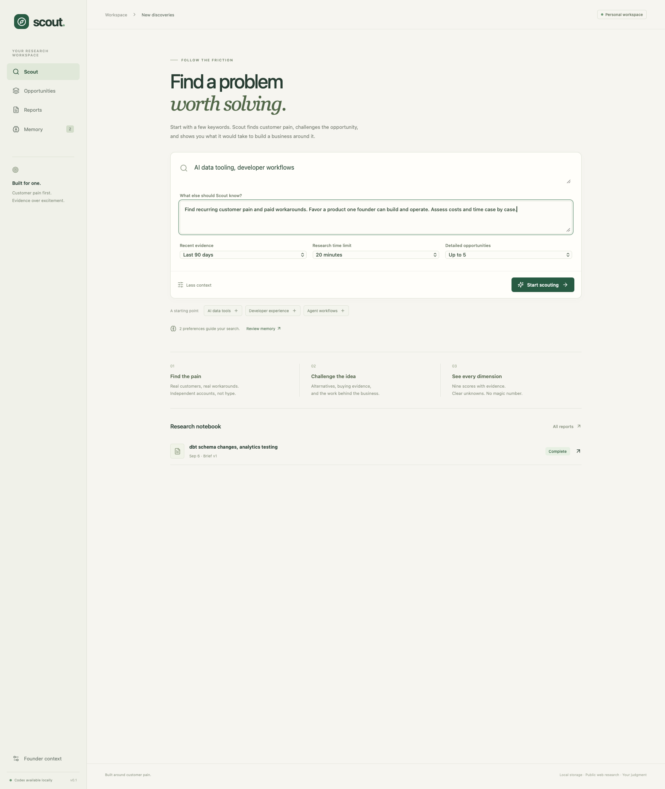
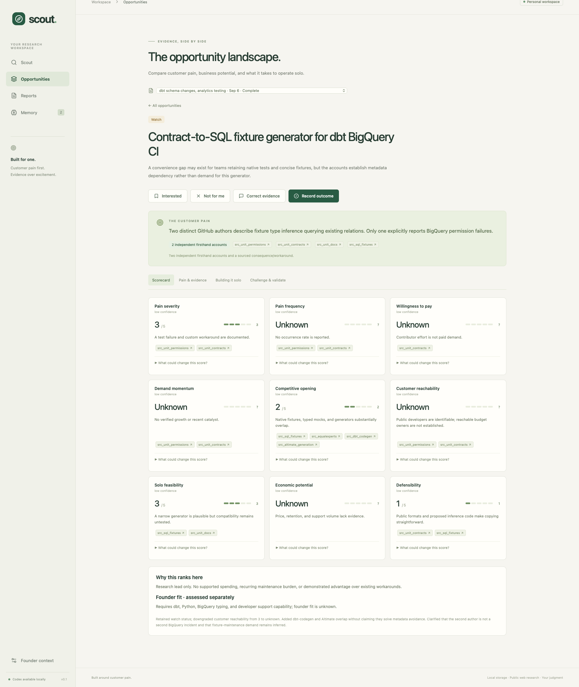
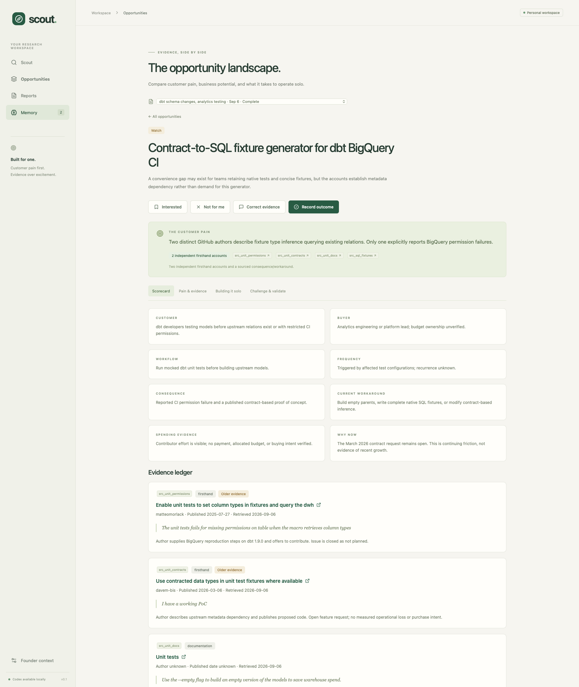
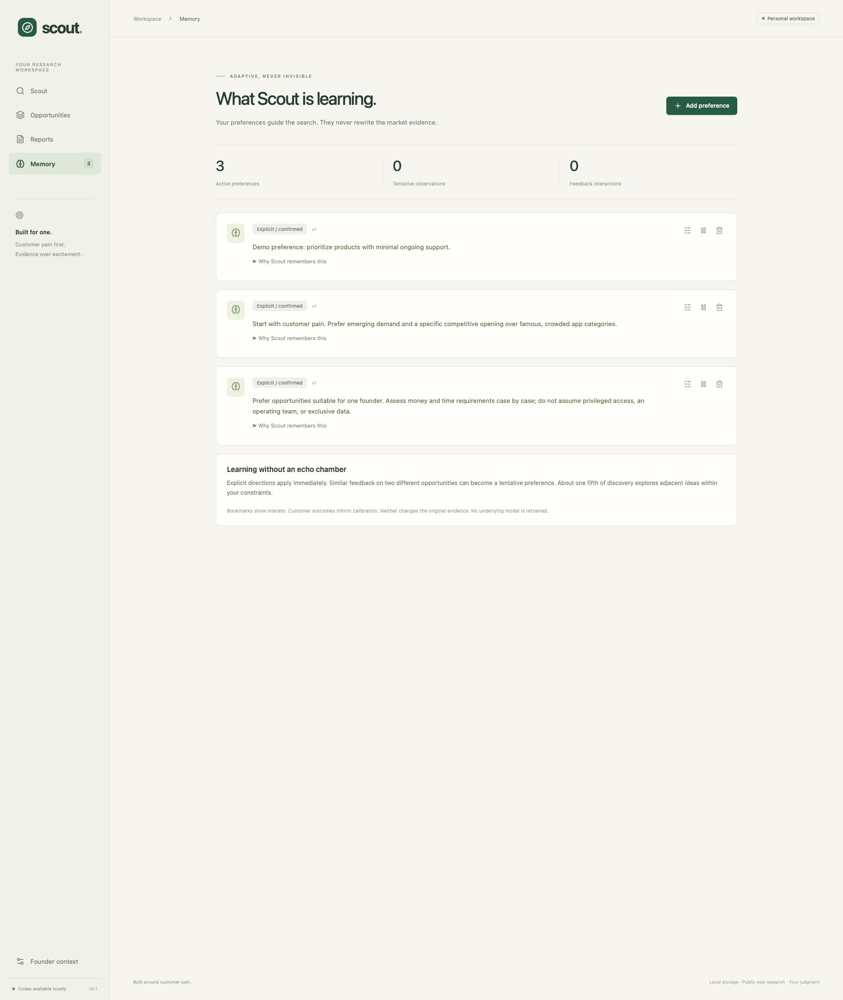
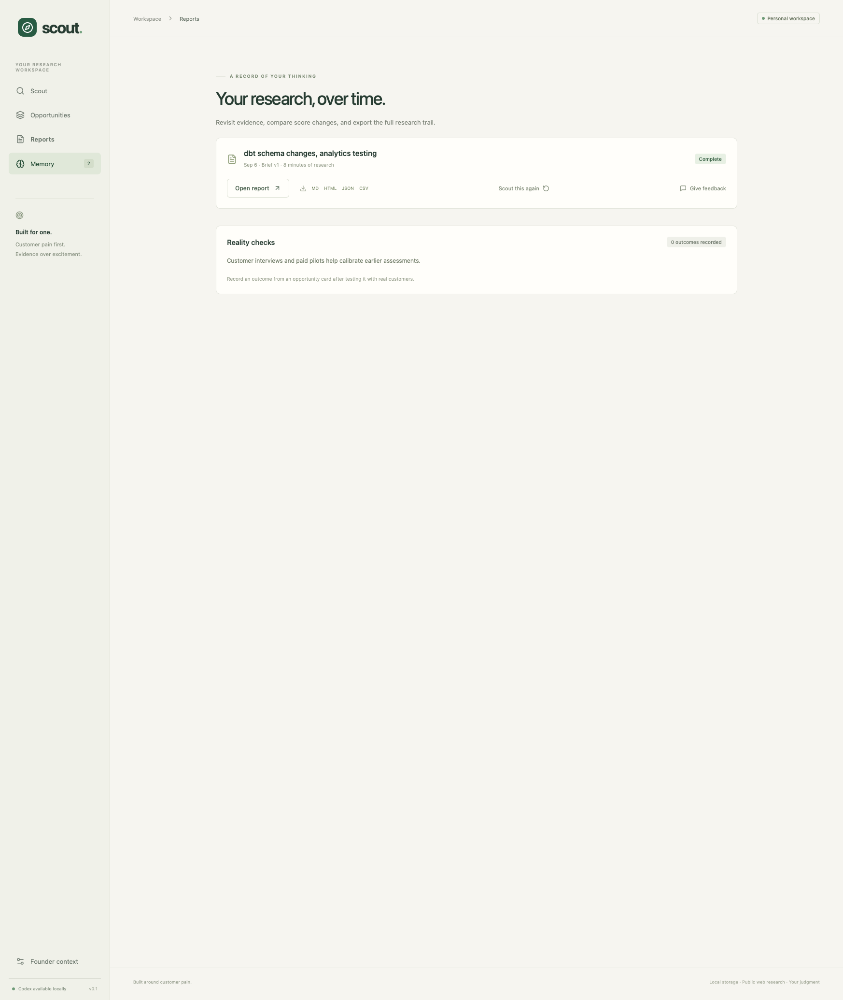

# cmux demo walkthrough

The demo was performed in the cmux browser against the local application at http://127.0.0.1:8765.

## 1. Start with keywords and optional context

Enter a topic, then add constraints if helpful. The displayed example input was not submitted as a new research run.

## 2. Inspect a real report

The completed live verification run researched **dbt schema changes and analytics testing**, gathered **11 sources**, and assessed two pain clusters. Its candidate, a contract-to-SQL fixture generator for dbt BigQuery CI, remained **Watch**. Recurring pain, willingness to pay, and economics were not established.

Each of the nine dimensions keeps its own evidence and confidence. Unknown is not zero, and there is no blended success score.

## 3. Follow the customer evidence

Pain records explain the workflow, consequence, workaround, spending evidence, and independent accounts. The ledger links to original sources and identifies old or uncertain evidence.

## 4. Inspect and reverse memory changes

A temporary preference was added through the UI, disabled, restored with Undo, and forgotten. It is no longer active and will not guide future research. The original two approved preferences remain active. No fabricated customer feedback or payment was recorded during this demo.

## 5. Revisit and export reports

Reports retain the brief revision and historical evidence. Export options include Markdown, standalone HTML, JSON, and CSV.

Validation completed before the demo: **36 backend tests**, **4 isolated browser tests**, a production frontend build, and a full live Codex research run. The cmux walkthrough exercised the actual local application; the automated browser tests use a separate temporary database and synthetic research provider.

## 6. Understand rejected research

The research trail shows every pain found, the stage where it advanced or stopped, the supporting sources, the failed gate, and the evidence that could reopen it. This example found four pain clusters but rejected product synthesis instead of manufacturing a startup opportunity.

Current validation: **85 backend tests** and **8 isolated browser tests**.
