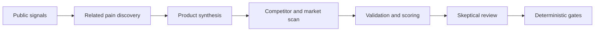

Opportunity Scout treats a complaint as a research signal, not a validated product. Each material
claim should remain traceable to a source record so you can inspect what was actually observed.

## Evidence rules

- Firsthand pain, consequences, workarounds, buying signals, pricing, and alternatives remain distinct.
- Repeated URLs, excerpts, or authors from one known organization do not create independent support.
- Unread, incomplete, private-address, and future-dated sources cannot support qualification.
- Missing or malformed required evidence causes deterministic gates to fail conservatively.
- Historical reports retain their original context instead of being silently rewritten.

## Research stages

If synthesis cannot form a coherent standalone product for one aligned buyer segment, the run ends
early. It reports that no product qualified instead of spending the remaining budget on issue-level
ideas.

## What still requires judgment

Source classification, claim entailment, cost estimates, and semantic matching remain model
judgments. Passing structural gates does not prove authenticity, demand, or product-market fit.

::: tip
Open the source ledger and inspect the cited passages before acting on a recommendation.
:::
